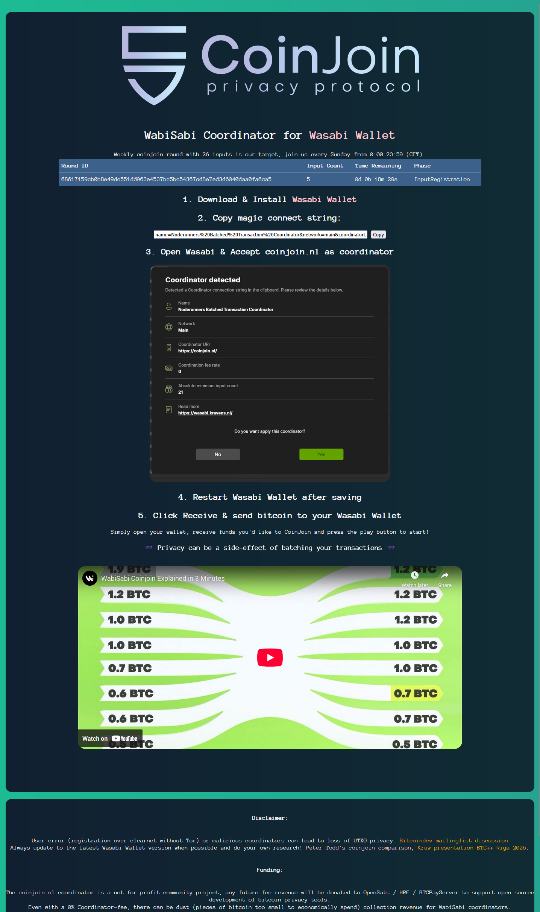

# coinjoin.nl
Self-hosted webpage for monitoring round status of WabiSabi coordinator server and explaining how to add the coordinator.

# How to run a wabisabi coordinator yourself
See my tutorial to learn how: 

https://planb.academy/en/tutorials/privacy/on-chain/coinjoin-coordinator-3e26b5be-d1f8-4253-9297-0e163c19b387
