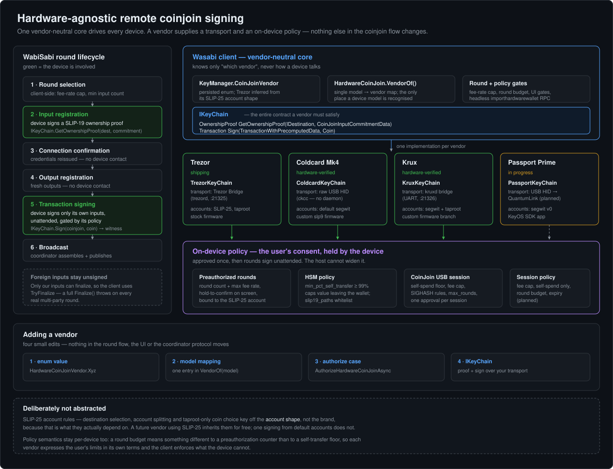

# coinjoin.nl tooling

Scripts, systemd units, nginx config and the landing page for the
[coinjoin.nl](https://coinjoin.nl) WabiSabi coordinator. Runs on a RaspiBlitz
box (aarch64). No secrets in this repo — RPC creds, SSL keys and wallet files
live outside it (see [Secrets](#secrets)).

## Layout

```
scripts/   Python/bash tooling
systemd/   service + timer that drive the scripts
nginx/     site + mempool reverse-proxy config (cert paths only, no keys)
web/       the static landing page
```

## What it does

The landing page renders the **latest successful coinjoin round** (a txflow
animation + an esplora-style viewer iframe) and a **latest-rounds table** with
per-round fee stats — refreshed every 5 minutes by a systemd timer.

```
wasabi-coinjoin-latest.timer  (every 5 min)
        └─> wasabi-coinjoin-latest.service  (oneshot, 3 steps)
              1. coinjoin-latest-txid.sh   greps the coordinator log for the last
                                           "Successfully broadcast" txid → writes
                                           web/latest-coinjoin.json, and (only when
                                           the txid changed) renders web/latest.html
                                           via txflow.py against the self-hosted
                                           mempool (http://localhost:4080).
              2. coinjoin-stats.py sync    stores new rounds in the SQLite fee DB
                                           (per-tx numbers from bitcoind JSON-RPC).
              3. coinjoin-stats.py latest 10 > web/latest-stats.txt  (table source)
```

`web/index.html` fetches `latest-coinjoin.json`, `latest.html` and
`latest-stats.txt` client-side and renders them.

## Scripts

| File | Purpose |
|------|---------|
| `txflow.py` | Animate a Bitcoin tx flow from mempool.space or a self-hosted mempool. `txflow.py <txid> --mempool http://localhost:4080 --export out.html`. |
| `coinjoin-stats.py` | SQLite log of successful coinjoins for fee stats (stdlib only). Subcommands: `sync`, `stats`, `latest [N]`, `lowest`. **Paths come from env vars** (`COINJOIN_COORD_CONFIG`, `COINJOIN_COORD_LOG`, `COINJOIN_DB`). The copy installed at `/usr/local/bin/` hardcodes box paths (`/var/lib/coinjoin-stats/coinjoin.db`, `/home/wasabi/.walletwasabi/coordinator/`); this env-driven copy is the publishable one. |
| `coinjoin-latest-txid.sh` | Publishes the latest broadcast txid as JSON and renders the txflow animation. |
| `coinjoin-history-backfill.py` | One-time historical backfill of the fee DB via electrs (`blockchain.scripthash.get_history` per coordinator scrap address). |
| `coinjoin-history-wait.sh` | Waiter that polls electrs and runs the backfill once it is indexed (used by a transient `systemd-run` unit). |

## Install on the box

```sh
sudo cp scripts/coinjoin-stats.py scripts/coinjoin-latest-txid.sh \
        scripts/coinjoin-history-*.{py,sh} /usr/local/bin/
sudo cp scripts/txflow.py /home/admin/txflow.py
sudo cp systemd/wasabi-coinjoin-latest.* /etc/systemd/system/
sudo cp nginx/coinjoin.nl.conf /etc/nginx/sites-available/
sudo cp nginx/mempool.conf /etc/nginx/snippets/
sudo cp web/index.html /var/www/coinjoin/ && sudo chown www-data:www-data /var/www/coinjoin/index.html
sudo systemctl daemon-reload && sudo systemctl enable --now wasabi-coinjoin-latest.timer
sudo nginx -t && sudo systemctl reload nginx
```

> The `coinjoin-stats.py` installed at `/usr/local/bin/` is the **hardcoded-path**
> variant. The copy in `scripts/` here is env-driven; set the `COINJOIN_*` env
> vars (or edit the paths) before relying on it directly.

## Viewer

The round viewer is a fork of `Copexit/am-i-exposed` and is built separately —
see [`viewer-mods.md`](viewer-mods.md).

## Secrets

Never committed; live outside this repo:

- `/home/wasabi/.walletwasabi/coordinator/Config.json` — bitcoind RPC user:pass, coordinator xpub
- `/etc/letsencrypt/**` — TLS private keys (the nginx conf only references their paths)
- bitcoind `bitcoin.conf` (`rpcpassword`), any Wasabi wallet files

Runtime artifacts (`latest*.json/html/txt`, `*.db`) are git-ignored — they
regenerate on the next timer tick.


## Hardware Wallet Signers

Status of hardware wallets as unattended WabiSabi coinjoin remote signers for
Wasabi Wallet (ownership proofs + round signing under an on-device policy):

| | **Trezor** | **Coldcard** | **Passport Prime** | **Krux** | **Ledger** | **SeedSigner** |
|---|---|---|---|---|---|---|
| **Wasabi branch** | [`feature/trezor-coinjoin`](https://github.com/kravens/WalletWasabi/tree/feature/trezor-coinjoin) | [`feature/coldcard-coinjoin`](https://github.com/kravens/WalletWasabi/tree/feature/coldcard-coinjoin) | [`feature/passport-coinjoin`](https://github.com/kravens/WalletWasabi/tree/feature/passport-coinjoin) | [`feature/krux-coinjoin`](https://github.com/kravens/WalletWasabi/tree/feature/krux-coinjoin) | none — feasibility study only | none — feasibility study only |
| **Wasabi client side** | ✅ TrezorKeyChain + bridge | ✅ ColdcardKeyChain + raw USB HID (no bridge daemon) — hardware-verified on a real Mk4 | ✅ PassportKeyChain (transport moving USB HID → QuantumLink) | ✅ `KruxKeyChain` + [kruxd](kruxd/kruxd.py) bridge on :21326 (serial COM8 / simulator TCP); `importkruxwallet` RPC, per-wallet round/fee policy | ❌ none (USB channel + [client libs](https://github.com/LedgerHQ/app-bitcoin) exist, no KeyChain) | ❌ none (airgapped QR, no USB data channel) |
| **Firmware requirement** | none — stock firmware has coinjoin support | custom [`feature/slip19-coinjoin`](https://github.com/kravens/firmware/tree/feature/slip19-coinjoin) branch ([PR #685](https://github.com/Coldcard/firmware/pull/685)) + HSM policy. **Must build with `DEBUG_BUILD=1`** — the makefile defaults to `0`, which disables `is_devmode` and with it the `dev.dfu` auto-install, serial REPL and `EXEC` escape hatches | custom coinjoin logic ([KeyOS branch](https://github.com/kravens/KeyOS/tree/feature/passport-coinjoin)) — needs 2 QuantumLink messages added upstream | custom [`feat/slip-19-coinjoin`](https://github.com/PMK/krux/tree/feat/slip-19-coinjoin) branch — builds via WSL docker, flashes to WonderMV over USB (`-B dan`, COM8) | fork of [app-bitcoin](https://github.com/LedgerHQ/app-bitcoin) needed: `AUTHORIZE_COINJOIN` + `GET_OWNERSHIP_PROOF` APDUs; swap mode already skips per-tx confirmation against a pre-approved policy — precedent to reuse | full fork needed: USB gadget (CDC) transport, SLIP-19/SLIP-21, session policy, seed persistence — none exists |
| **Ownership proofs (SLIP-19)** | ✅ device-native | ✅ segwit + taproot — **verified on a real Mk4** (147-byte ECDSA / 105-byte BIP-340), both accepted by Wasabi's own `OwnershipProof.VerifyOwnership`; taproot output key derived through NBitcoin's BIP-86 tweak as an independent check. Ownership identifier is the real SLIP-21 derivation (`HMAC-SHA256` keyed from `m/"SLIP-0019"/"Ownership identification key"`), agreed byte-for-byte by three independent implementations — firmware, a host reference and Wasabi's own test — against the published SLIP-19/SLIP-21 vectors, and pinned by mutation-checked tests. That derivation is currently verified in the simulator only: the hardware run below predates the commit and carried the 32-zero placeholder, so on-device re-verification waits on the next flash. xprv-imported secrets have no seed, so proofs are refused rather than given a fabricated id | ✅ segwit + taproot (spec vector + BIP-86 vector) | ✅ on-device `create_proof` P2WPKH + P2TR (SLIP-21 ownership key); vectors pass Wasabi's verifier | ❌ not implemented (`SIGN_MESSAGE` can't produce SLIP-19 sighash format) | ❌ not implemented |
| **Unattended round signing** | ✅ on-device authorization, SLIP-25 account | ✅ HSM policy (`min_pct_self_transfer` floor) — policy install, on-device approval and unattended policy-gated PSBT signing all verified on a real Mk4 | ✅ session policy: fee cap, self-spend only, round budget, expiry | ✅ "CoinJoin USB" session: one on-device approval (fingerprint + policy summary), then unattended proofs + signing over framed UART link; self-spend floor, fee cap, SIGHASH rules, round budget (`max_rounds`) enforced | ❌ none; NVRAM policy storage feasible (MuSig2 sessions + BIP-388 HMAC precedents) | ❌ stateless by design: no policy storage, QR per interaction |
| **Real device tested** | ✅ | ✅ **full round on real hardware (Mk4, 2026-07-25)** — custom `slp9` firmware flashed to a retail unit, then a complete WabiSabi round on regtest: SLIP-19 proof accepted at input registration, PSBT signed unattended under the HSM policy, coinjoin `1cba3f80…499e` confirmed on-chain (2 in / 8 out, our outputs anon-set 1.00 → 1.20). Device tally 6 approvals, 0 refusals. The 99% `min_pct_self_transfer` floor was also exercised directly: 50% and 98.5% self-transfer refused, 99.5% and 99.9% signed. Rollback to stock 5.4.3 verified installable (device highwater is unset, image sets no downgrade floor). Caveat unchanged: retail units are RDP2-locked, so the bootloader refuses ROM DFU and a boot-crashing build cannot be recovered — build with `DEBUG_BUILD=1` so `dev.dfu`/REPL/`EXEC` remain as escape hatches. Mk4 is the only viable model (Q disables HSM, Mk3 too old) | ❌ retail locked to vendor-signed firmware; building as official KeyOS SDK app — awaiting Foundation dev unit | ✅ WonderMV signed live WabiSabi coinjoin rounds on regtest (2026-07-13) — device validated PSBTs against on-device policy, signed own inputs over USB, txns broadcast + confirmed; 1134 unit tests pass | ❌ — Nano S Plus only sideloadable target (Nano X blocks sideloading, Nano S EOL/unsupported); Speculos emulator for dev | ❌ |
| **Script types** | taproot (SLIP-25) | segwit (taproot proofs verified, signing follow-up) | segwit v0 signing; proofs segwit + taproot | segwit + taproot (P2WPKH/P2TR only, enforced in psbt validation) | n/a | n/a |
| **Readiness** | **closest to production** | **proven end-to-end on hardware** — client, firmware and on-device policy all exercised in a confirmed coinjoin. Remaining before upstream ([PR #685](https://github.com/Coldcard/firmware/pull/685) open): the SLIP-21 ownership id is implemented and vector-pinned but not yet exercised on hardware, Linux/macOS HID transport unwritten, taproot *signing* untested. Firmware iteration still wants a non-RDP2 dev unit — every retail flash is one-way | **collaborating with Foundation** — logic done + tested; SDK app over QuantumLink pending dev unit + [protocol proposal](https://github.com/kravens/KeyOS/blob/feature/passport-coinjoin/os/wallet-rpc/COINJOIN_PROPOSAL.md) ([status](passport/PASSPORT_TESTING.md)) | **working end-to-end on hardware** ([bring-up guide](kruxd/README.md)) | **feasibility researched — upstream unlikely (silent signing gated to Ledger swap partners), sideload-only fork** | **concept stage — conflicts with stock security model** |

### How the vendor-agnostic signer works



Every device above plugs into the same core. Wasabi's coinjoin flow never learns how a
particular device talks — it only records *which vendor* signs a wallet
(`KeyManager.CoinJoinVendor`), maps a connected model to that vendor in one place
(`HardwareCoinJoin.VendorOf`), and dispatches once when authorizing a batch of rounds. Signing
itself goes through `IKeyChain`, whose entire contract is two calls: produce a SLIP-19 ownership
proof for an input, and sign our own inputs of a coinjoin. A device is touched at exactly two
points in a round — input registration and transaction signing — and not at all in between.

The consent model is deliberately left to each device rather than flattened into a common
abstraction, because the guarantees genuinely differ: a Trezor counts down preauthorized rounds
bound to its SLIP-25 account, a Coldcard enforces a `min_pct_self_transfer` floor in its HSM
policy, Krux holds a CoinJoin USB session with its own fee cap and round budget. Each expresses
the user's limits in its own terms; the client enforces whatever the device cannot (round budget,
fee-rate cap on round selection) and refuses to widen anything the device already decided.

SLIP-25 account behaviour — destination selection, account splitting, taproot-only coin choice —
keys off the *account shape* rather than the brand, so a future vendor that adopts SLIP-25
inherits it and one signing from the default accounts does not. Adding a vendor is four small
edits: an enum value, a model-to-vendor entry, a case in `AuthorizeHardwareCoinJoinAsync`, and an
`IKeyChain` implementation over whatever transport the device speaks.
