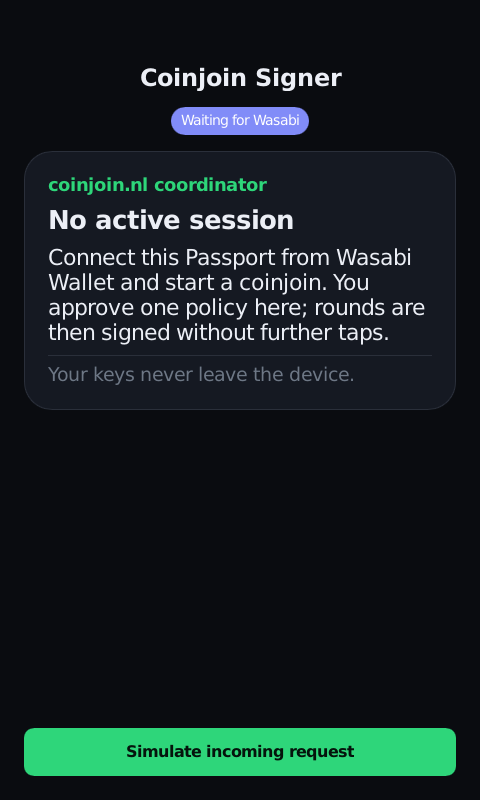
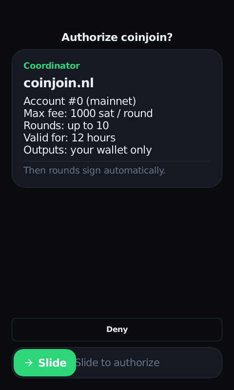
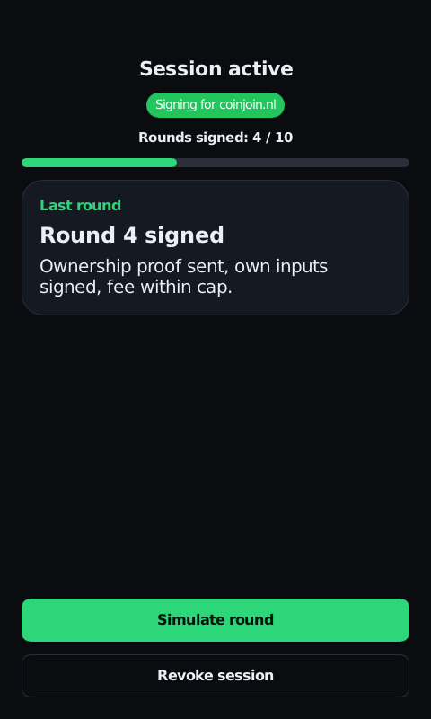
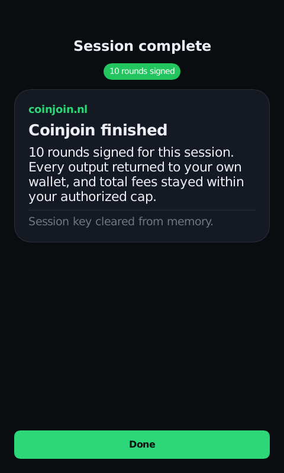

# Coinjoin Signer — Passport Prime app (functional mockup)

A KeyOS SDK app: the on-device UI for using Passport Prime as an unattended
WabiSabi coinjoin signer for Wasabi Wallet. **The signing logic is real** — the
app links [`wallet-rpc-core`](https://github.com/kravens/KeyOS/tree/feature/passport-coinjoin)
(the exact policy/session/SLIP-0019 engine from the KeyOS branch, 32 unit
tests): slide-to-authorize opens a real session, and every "Simulate round"
produces a real SLIP-0019 ownership proof, policy-checked against the
coordinator binding. Dark-first, matching Wasabi.

Mocked edges only: the seed is the published SLIP-0019 **test vector** (never a
user seed) and the transport is button-driven — the real QuantumLink transport
comes once Foundation adds the two coinjoin messages
([proposal](https://github.com/kravens/KeyOS/blob/feature/passport-coinjoin/os/wallet-rpc/COINJOIN_PROPOSAL.md)).

## Screens

| Home | Authorize | Session | Complete |
|---|---|---|---|
|  |  |  |  |

1. **Home** — idle, "Waiting for Wasabi".
2. **Authorize** — the one human approval: coordinator, account, per-round fee
   cap, round budget, 12-hour expiry, then slide-to-authorize.
3. **Session active** — live round counter; each "Simulate round" runs the real
   engine (SLIP-0019 proof for the next index, coordinator-bound commitment) and
   shows the result; revoke closes the session.
4. **Complete** — session summary.

Screenshots rendered from the real Slint UI (Foundation SDK `foundation preview`,
480×800). The buttons use a small local `ui/cjbutton.slint` instead of the SDK
`Button`: the lightweight preview viewer doesn't populate the theme's button
style/size structs, so the stock `Button` renders invisible there — the local
one paints in the viewer and on-device alike (it uses `palette-*`, which have
literal defaults).

## Build & run (Foundation SDK)

Needs the Foundation Passport Prime SDK (public beta) + Nix. `Cargo.toml` deps
point at `__SDK_KEYOS_ROOT__` — either regenerate the scaffold and drop these
`ui/`, `theme/`, `app-config.toml` files in, or substitute your
`~/.foundation/sdk/current/lib/keyos` path.

```sh
foundation new coinjoin-signer -t multi-page-app   # scaffold
# copy this repo's ui/, theme/, app-config.toml over the scaffold
foundation cert gen coinjoin.nl \                  # one-time dev signing cert
  --publisher-name coinjoin.nl --contact-email you@example.com
foundation build      # builds + signs for armv7a-unknown-xous-elf
foundation sideload   # copies the signed bundle to a connected Passport Prime
                      # over USB storage and launches it
```

`foundation build` cross-compiles for the device (`armv7a-unknown-xous-elf`),
strips, generates `manifest.json`, and signs with the dev cert — output at
`target/keyos/coinjoin-signer/{app.elf,manifest.json}`. Run it inside the SDK's
Nix dev shell so the Xous rust target is on `PATH`:

```sh
nix develop ~/.foundation/sdk/current --command \
  bash -c 'foundation build'
```

To iterate on the UI headlessly (no device, no GUI simulator), render individual
components with the preview viewer under Xvfb — see `ui/_preview.slint` for the
480×800 window harness (one wrapper per screen).

Build notes for the `wallet-rpc-core` link: the app patches `getrandom` with a
Xous-backend copy (`vendor/getrandom`, its `xous` dep pointed at the SDK's
`xous-rs` — the KeyOS repo's copy would drag a second `keyos` package into the
graph and collide), and `.cargo/config.toml` sets
`CC_armv7a_unknown_xous_elf=arm-none-eabi-gcc` for `secp256k1-sys`.

## Status

Built against Foundation SDK 0.4.0. Functional mockup on a test-vector seed;
not for real funds. Verified: `foundation build` produces a **signed** armv7
bundle (`app.elf` + `manifest.json`) with `wallet-rpc-core` linked, ready for
`foundation sideload`; the KeyOS simulator launches the signed app
(cosign2-accepted). All four screens render dark (screenshots above).

Sideloading to a **retail** Passport Prime depends on the device accepting a
self-signed dev cert over the USB-storage sideload path (vs. cosign2
`FullyTrusted` for store apps) — to be confirmed on the physical device / with a
Foundation dev unit.
