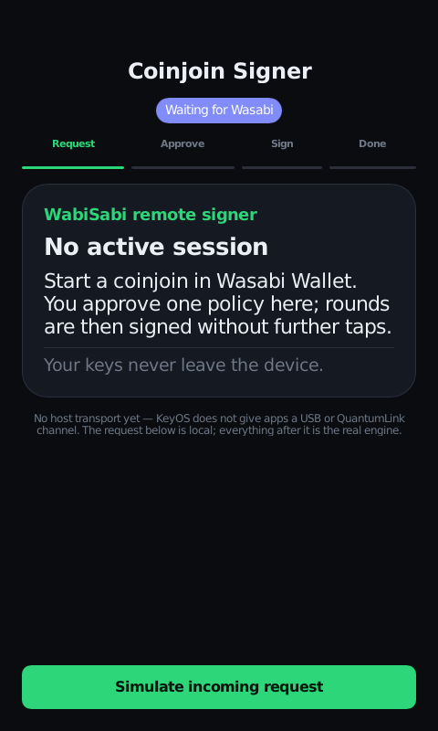
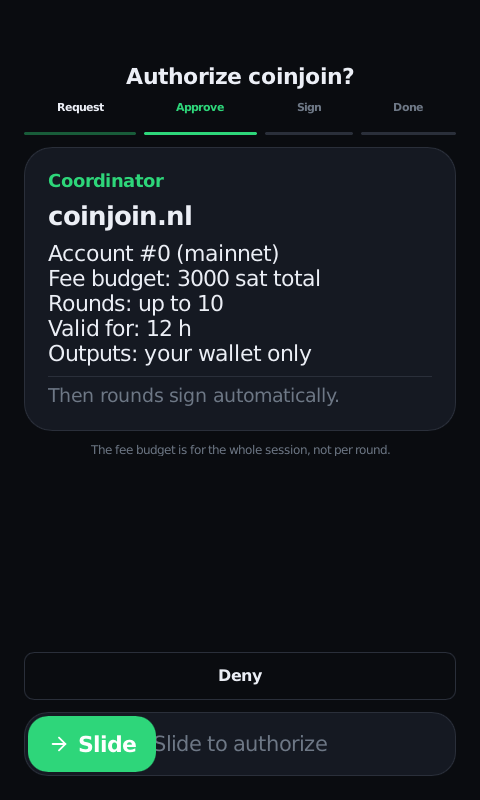
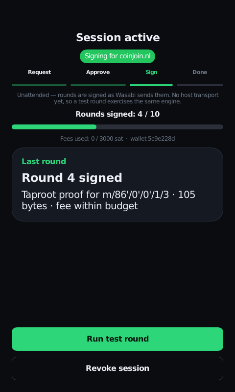
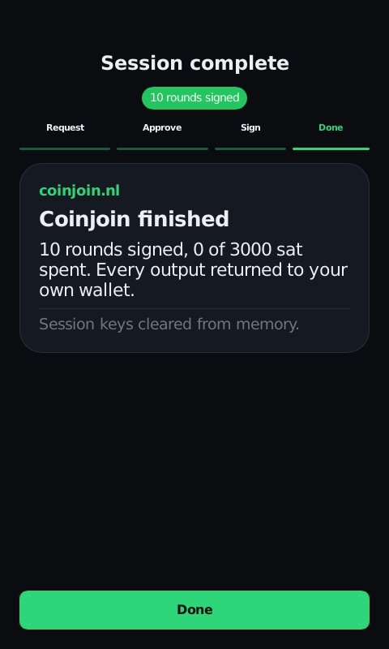

# Coinjoin Signer — Passport Prime app

A KeyOS SDK app: the on-device UI and signing engine for using Passport Prime as
an unattended WabiSabi coinjoin signer for Wasabi Wallet. Dark-first, matching
Wasabi.

Everything on the key side is real. The seed comes from `os/security` — read
**once**, at authorization, behind the trusted-display confirmation — and is
immediately reduced to the session's account keys (`m/84'` and `m/86'`) plus the
SLIP-0019 ownership node; the seed itself is dropped and zeroized. Rounds are
then served from those cached keys with no further prompts: SLIP-0019 ownership
proofs (segwit v0 and taproot) and BIP-341 key-spend signatures, each checked
against the policy the user approved.

The one thing that is not real yet is the **wire**. SDK 0.4.0 ships no `api/usb`
crate, and its `api/quantum-link` exposes only pairing, magic backup and
firmware fetch — no channel an app could carry coinjoin rounds over. So the
request that opens a session is built locally by the "Simulate incoming request"
button: it fills the same pending-policy slot a host message will, and binding
the transport changes only where the policy bytes come from. The protocol
itself (`crates/wallet-rpc-core/src/protocol.rs`) is implemented and tested, and
the Wasabi-side client already speaks it. Whether `os/usbdev` is nevertheless
reachable from an app is measured, not assumed — see `usb-probe` below.

## Screens

| Home | Authorize | Session | Complete |
|---|---|---|---|
|  |  |  |  |

1. **Home** — idle, "Waiting for Wasabi", and an honest note that there is no
   host transport yet.
2. **Authorize** — the one human approval, rendering the actual policy the
   engine will enforce: coordinator, account, network, **total** fee budget,
   round budget, expiry. Slide to authorize; the seed prompt follows.
3. **Session active** — live rounds signed, fees used against the budget, and
   the wallet fingerprint the session derived from (it must match the wallet in
   Wasabi). Rounds arrive from Wasabi once there is a transport; until then
   "Run test round" drives the same engine with a locally built request — a
   taproot SLIP-0019 proof for the next address, bound to the authorized
   coordinator.
4. **Complete** — session summary; keys are zeroized on revoke/expiry.

Screens are rendered from `ui/_preview.slint` (a 480×800 wrapper per page) with
the SDK preview viewer under Xvfb. An older simulator recording, from the
simulator's own record button, is in
[`screenshots/demo.mp4`](screenshots/demo.mp4).

The buttons use a small local `ui/cjbutton.slint` instead of the SDK `Button`:
the lightweight preview viewer doesn't populate the theme's button style/size
structs, so the stock `Button` renders invisible there — the local one paints
in the viewer and on-device alike (it uses `palette-*`, which have literal
defaults).

## Layout

```
crates/wallet-rpc-core/   engine: protocol v2, policy + sessions, SLIP-0019,
                          taproot signing, HID framing (45 unit tests)
src/coinjoin.rs           PrimeBackend (os/security seed + secure random) and
                          the Slint bridge
vendor/security/          os/security client, vendored from KeyOS v1.3.1 — the
                          SDK ships no api/security crate
vendor/getrandom/         getrandom with the Xous backend, for ngwallet
```

The engine crate is deliberately transport- and backend-agnostic: the same code
is carried on the KeyOS `feature/passport-coinjoin` branch as the `wallet-rpc`
system-service proposal, and is driven by a hosted integration test there.

## Security properties

- **One prompt per session.** `os/security` confirms seed access on the trusted
  display once; the derived account keys serve every round after that.
- **Account keys, not the seed.** A memory disclosure in this app exposes one
  coinjoin account, not the master secret. Keys live in `Zeroizing` buffers and
  are wiped on revoke, expiry, or a new authorization.
- **The fee budget is the session total.** `fee_budget_sats` bounds the sum of
  `our inputs − our outputs` across every round, so the number the user approves
  is the real exposure (a per-round cap would silently multiply by the round
  count).
- **Outputs must return to the approved account.** Only outputs that re-derive
  to keys under the policy account count as credit; a lying host gains nothing.
- **Random session token.** 16 bytes from the secure element, required on every
  proof, signature, and revoke, compared in constant time. No entropy, no
  session.
- **Bounded inputs.** PSBTs are capped at 512 KiB, other commands at 4 KiB, and
  the device never buffers a frame longer than the cap claims.

## Build & run (Foundation SDK)

Needs the Foundation Passport Prime SDK (0.4.0 public beta) + Nix. `Cargo.toml`
dependency paths point at a local SDK checkout — substitute your
`~/.foundation/sdk/current/lib/keyos` path if it differs.

```sh
foundation cert gen coinjoin.nl \                  # one-time dev signing cert
  --publisher-name coinjoin.nl --contact-email you@example.com
nix develop ~/.foundation/sdk/current --command foundation build
nix develop ~/.foundation/sdk/current --command foundation sim      # simulator
foundation sideload                                # signed bundle to a device
```

`foundation build` cross-compiles for `armv7a-unknown-xous-elf`, strips,
generates `manifest.json`, and signs with the dev cert — output at
`target/keyos/coinjoin-signer/{app.elf,manifest.json}`. Run it inside the SDK's
Nix dev shell so the Xous target is available.

Engine tests run on the host: `cargo test -p wallet-rpc-core`.

Build notes for the `wallet-rpc-core` link: the app patches `getrandom` with a
Xous-backend copy (`vendor/getrandom`, its `xous` dep pointed at the SDK's
`xous-rs` — the KeyOS repo's copy would drag a second `keyos` package into the
graph and collide), and `.cargo/config.toml` sets
`CC_armv7a_unknown_xous_elf=arm-none-eabi-gcc` for `secp256k1-sys`.

### `usb-probe`

Whether rounds can arrive over USB comes down to one question: does `os/usbdev`
answer a third-party app? The SDK ships no `api/usb` crate and Foundation's
public position is "not yet", but the same was assumed of the `os/security`
seed permission and that turned out to be grantable — so `vendor/usbdev-probe`
asks the server directly with three read-only queries.

`--features usb-probe` runs it at startup and logs the answer. It touches no
keys and opens no session, so it is safe on a real device; read the result with
`foundation logs`. The simulator cannot answer — it runs no USB server at all
(the probe reports exactly that), so this one needs hardware.

### `sim-selftest`

The simulator has no scriptable touch input, so the key path can't be reached by
driving the UI headlessly. Building with `--features sim-selftest` adds a startup
probe that opens a session and produces a proof without a human gesture, logging
each step. It is **off by default and must never be enabled in a shipped
bundle** — and its seed-provisioning branch additionally needs a
`SetSeedAndPin` permission the shipped manifest does not carry.

## Status

Built against Foundation SDK 0.4.0; requires KeyOS 1.4.0-beta1 or later on the
device (third-party app install + Allowed Publishers trust store). Not audited,
and not yet exercised against a live coordinator — there is no host transport to
do it over.

Verified:

- `cargo test -p wallet-rpc-core` — 45 tests: SLIP-0019 spec vector, BIP-86
  vector, taproot round signing, cumulative fee budget, token authentication,
  frame limits.
- **Simulator, signed bundle, real `os/security`:** the app launches, `GetSeed`
  is granted to a third-party app, the session derives from the device seed
  (fingerprint `5c9e228d` for the test seed), the secure element supplies the
  session token, and the resulting taproot ownership proof matches the
  functional core byte for byte.
- KeyOS branch hosted integration test (`security-server settings-server
  wallet-rpc-test`) — the same engine against the real security server:
  authorize, xpub, segwit + taproot proofs, a signed taproot round, foreign
  coordinator rejected, wrong token rejected.
- `foundation build` produces a signed armv7 bundle whose manifest requests only
  `os/security: [GetSeed, GetRandom]` beyond the GUI app template.

## License

This app is [MIT](LICENSE.md), matching Wasabi Wallet — so the Wasabi-facing
integration and this app share one permissive license.

The signing engine, `crates/wallet-rpc-core`, is dual-licensed
**`MIT OR GPL-3.0-or-later`** — so the whole app is usable under MIT, while the
engine still merges cleanly into the GPLv3 KeyOS tree when contributed upstream.
The vendored `vendor/security` client is Foundation's GPL-3.0-or-later code.
